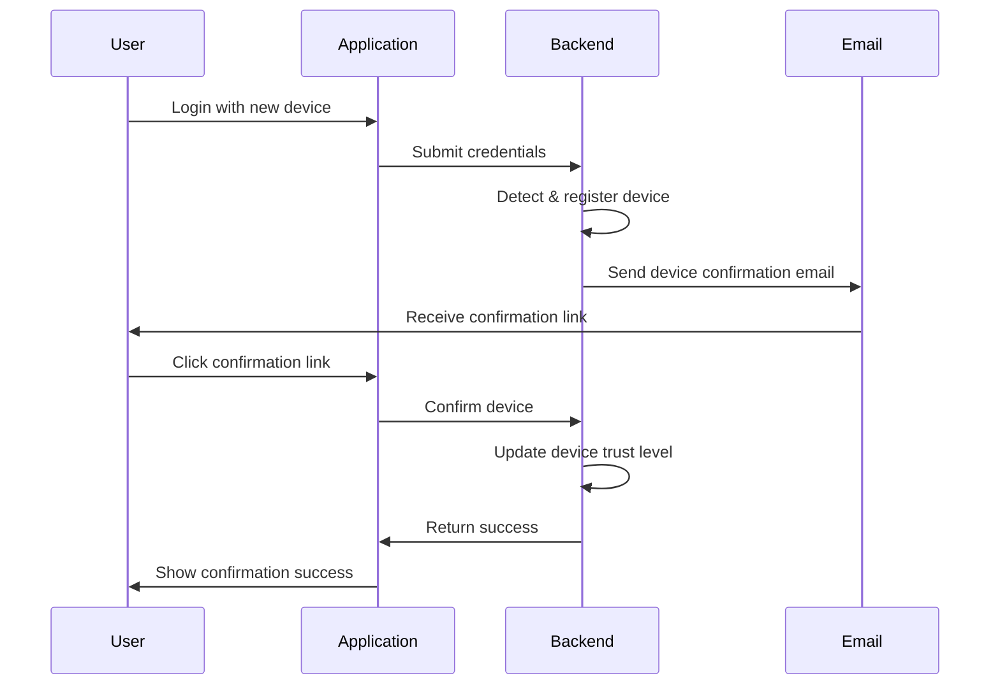

# Authentication System Architecture Documentation

## Overview

This document provides a comprehensive guide to the authentication system implemented in the CoreProject application. The system uses a modern JWT-based authentication approach with cookie-based token storage, device tracking, and automatic token refresh capabilities.

## Table of Contents

1. [Architecture Overview](#architecture-overview)
2. [Authentication Flow](#authentication-flow)
3. [Key Components](#key-components)
4. [Public vs. Protected Routes](#public-vs-protected-routes)
5. [Security Considerations](#security-considerations)
6. [Device Management](#device-management)
7. [Token Management](#token-management)
8. [Troubleshooting](#troubleshooting)

## Architecture Overview

The authentication system is built around these key principles:

- JWT tokens stored in HTTP-only cookies
- Separate access and refresh tokens
- Device-aware authentication
- Role-based access control
- Automatic token refresh via HTTP interceptor

### Visual Architecture

```
┌───────────────┐     ┌───────────────┐     ┌───────────────┐
│               │     │               │     │               │
│  Angular UI   │◄────┤   Spring Boot │◄────┤   Database    │
│  Frontend     │     │   Backend     │     │               │
│               │     │               │     │               │
└───────────────┘     └───────────────┘     └───────────────┘
        │                     │                     │
        │                     │                     │
        ▼                     ▼                     ▼
┌───────────────┐     ┌───────────────┐     ┌───────────────┐
│  Auth Service │     │   JWT Filter  │     │  Token Store  │
│  Interceptor  │     │   & Util      │     │               │
└───────────────┘     └───────────────┘     └───────────────┘
```

## Authentication Flow

### Login Process

1. User submits credentials via login form
2. Backend validates credentials and identifies the user's device
3. If credentials are valid:
   - Access token is generated with short lifetime (15 min)
   - Refresh token is generated with longer lifetime (7 days)
   - Both tokens are stored as HTTP-only cookies
   - Device information is associated with tokens
4. User is redirected to the application

### Token Refresh Flow

1. When an authenticated API request returns a 401/403 error
2. The HTTP interceptor catches the error
3. Interceptor makes a refresh token request to the server
4. If successful:
   - New access token is received
   - Original request is retried with the new token
5. If refresh fails:
   - User is redirected to login page
   - Authentication state is cleared

## Key Components

### Frontend Authentication Components

#### 1. OldAuthService (`old.auth.service.ts`)

The central service managing authentication state:

```typescript
@Injectable({ providedIn: 'root' })
export class OldAuthService {
  // State management with Angular signals
  private _state = signal<AuthState>({...});
  
  // Public computed signals for reactive state
  readonly isAuthenticated = computed(() => this._state().isAuthenticated);
  readonly user = computed(() => this._state().user);
  
  // Authentication methods
  login(credentials): Observable<void> {...}
  logout(): Observable<void> {...}
  refreshToken(): Observable<void> {...}
  initialize(): Promise<void> {...}
}
```

#### 2. AuthInterceptor (`auth-interceptor.ts`)

HTTP interceptor that:
- Attaches cookies and CSRF tokens to outgoing requests
- Handles authentication errors (401/403)
- Implements automatic token refresh
- Respects public routes configuration

#### 3. Public Routes Configuration (`public-routes.config.ts`)

Defines which routes are accessible without authentication:

```typescript
export const PUBLIC_API_ROUTES = [
  '/api/auth/login',
  '/api/auth/refresh-token',
  // ...
];

export const PUBLIC_FRONTEND_ROUTES = [
  '/auth/login',
  '/auth/signup',
  '/auth/test',
  // ...
];

export function isPublicApiRoute(url: string): boolean {...}
export function isPublicFrontendRoute(url: string): boolean {...}
```

### Backend Authentication Components

#### 1. JwtFilter (`JwtFilter.java`)

Middleware that:
- Extracts JWT from cookies
- Validates tokens for each request
- Populates security context with authenticated user
- Adds JWT claims to request attributes

#### 2. JwtUtil (`JwtUtil.java`)

Utility that:
- Generates JWTs with user and device information
- Validates tokens
- Handles token extraction and parsing

#### 3. SecurityConfig (`SecurityConfig.java`)

Configures security rules:
- Defines public and protected API paths
- Sets up the JWT filter
- Configures CORS and CSRF protection
- Configures role-based access control

#### 4. Auth Service (`AuthServiceImpl.java`)

Implements core authentication logic:
- User registration
- Login validation
- Account confirmation
- Password management
- Email verification

## Public vs. Protected Routes

### Frontend Routes

Routes are categorized as:

1. **Public Routes**: Accessible without authentication
   - `/` (Home)
   - `/auth/login`
   - `/auth/signup`
   - `/auth/forgot-password`
   - `/auth/account-confirmation`
   - `/auth/device-confirmation`
   - `/auth/test`

2. **Protected Routes**: Require authentication
   - `/profile`
   - `/devices`
   - `/admin/*`

### Backend API Routes

1. **Public Endpoints**: No authentication required
   - `/api/auth/login`
   - `/api/auth/signup`
   - `/api/auth/refresh-token`
   - `/api/account-confirmation/*`
   - `/api/password/*` (for password reset)
   - `/api/device/confirm`

2. **Protected Endpoints**: Require valid JWT
   - `/api/auth/me`
   - `/api/user/*`
   - `/api/device/my-list`
   - `/api/admin/*` (requires ADMIN role)

## Device Management

The system tracks and manages user devices:

### Device Registration

1. On login, the backend detects device via User-Agent, IP, and browser fingerprint
2. New devices start with `UNTRUSTED` level
3. User receives email notification for new device login
4. User can confirm device via email link

### Device Trust Levels

- `UNTRUSTED`: New or unverified device
- `BASIC`: Device confirmed once
- `TRUSTED`: Regularly used device
- `HIGHLY_TRUSTED`: Primary device with strong authentication

### Device Confirmation Flow



## Token Management

### Token Types

1. **Access Token**
   - Short lifetime (15 min)
   - Contains user info, roles, and device ID
   - Used for API authorization

2. **Refresh Token**
   - Longer lifetime (7 days)
   - Stored in database with device association
   - Used to obtain new access tokens

3. **Account Confirmation Token**
   - 24-hour lifetime
   - Used to verify new accounts
   
4. **Password Reset Token**
   - 15-minute lifetime
   - Used for secure password reset

5. **Device Confirmation Token**
   - 15-minute lifetime
   - Used to confirm new devices

### Token Storage

- Frontend: HTTP-only cookies (inaccessible to JavaScript)
- Backend: JWTs validated via signature, refresh tokens in database

## Security Considerations

1. **Protection Against XSS**
   - Tokens stored in HTTP-only cookies
   - Frontend uses appropriate Angular security practices

2. **Protection Against CSRF**
   - CSRF tokens used for state-changing operations
   - CSRF token added automatically by interceptor

3. **Token Security**
   - Short-lived access tokens
   - Tokens bound to specific devices
   - Automatic token invalidation on logout

4. **Device Security**
   - New device notifications
   - Device confirmation required
   - Trust level enforcement for sensitive operations

## Troubleshooting

### Common Issues

1. **Unauthorized Access to Public Routes**
   - Check if route is correctly configured in `PUBLIC_FRONTEND_ROUTES`
   - Verify that interceptor is checking `isPublicFrontendRoute()`
   - Ensure auth service's initialize method doesn't block public routes

2. **Failed Token Refresh**
   - Check for cookie restrictions (SameSite, Secure flags)
   - Verify that refresh token is being sent in requests
   - Check if refresh token is expired or revoked in database

3. **Unexpected Redirects**
   - Verify interceptor logic for handling 401/403 errors
   - Check if current route is being properly checked against public routes

### Debugging Tips

1. Add logging to the authInterceptor to track when refresh attempts happen
2. Check browser's Application tab to verify cookies are being set correctly
3. Use the Network tab to check actual HTTP responses from the server
4. Monitor console for authentication-related errors

---

This documentation provides a high-level overview of the authentication system. For specific implementation details, refer to the source code and inline comments.
